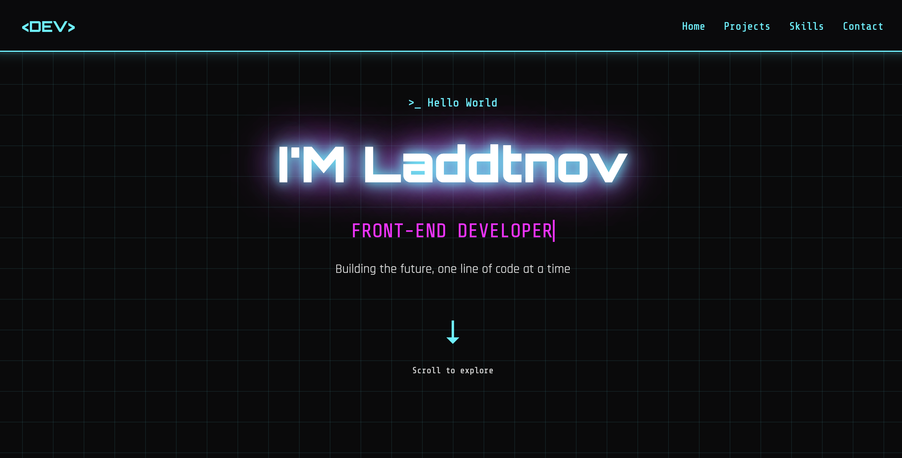

# portfolio-website
My personal portfolio website built with HTML5, CSS3, and animations. Cyberpunk-themed design showcasing my projects and skills.
you can see the live version of this project here: 
👉 ** https://laddtnov-dev.netlify.app/**
# Personal Portfolio Website 💼

<div align="center">


A modern, cyberpunk-themed portfolio website showcasing my web development projects and skills.

🌐 **[Live Demo](https://portfolio-website-six-wine-21.vercel.app/)** | 📁 **[Source Code](https://portfolio-website-six-wine-21.vercel.app/)**



</div>

---

## ✨ Features

🎨 **Cyberpunk Design** - Neon colors, glitch effects, and animated grid background  
📱 **Fully Responsive** - Works seamlessly on desktop, tablet, and mobile  
⚡ **Smooth Animations** - CSS keyframe animations and transitions  
🎯 **Interactive UI** - Hover effects and animated elements  
🧹 **Clean Code** - Well-structured HTML and CSS with custom properties

## 🚀 Technologies Used

<table>
  <tr>
    <td align="center" width="96">
      
      <br>HTML5
    </td>
    <td align="center" width="96">
      
      <br>CSS3
    </td>
    <td align="center" width="96">
      
      <br>Git
    </td>
    <td align="center" width="96">
      
      <br>GitHub
    </td>
  </tr>
</table>

### Core Technologies
- ✅ **HTML5** - Semantic markup
- ✅ **CSS3** - Modern styling
  - CSS Grid & Flexbox
  - CSS Variables (Custom Properties)
  - CSS Animations (@keyframes)
  - Media Queries
- ✅ **Google Fonts** - Orbitron, Rajdhani, Share Tech Mono

## 📂 Project Structure
```
portfolio-website/
├── 📄 index.html          # Main HTML file
├── 🎨 styles.css          # All styles and animations
└── 📖 README.md           # Project documentation
```

## 🎨 Design Features

### 🌈 Color Palette
```css
--neon-cyan:    #00f2ff;
--neon-pink:    #ff00ff;
--neon-purple:  #9d00ff;
--dark-bg:      #0a0a0c;
```

### 📍 Key Sections
1. **🏠 Welcome Section** - Animated hero with glitch effects
2. **💼 Projects Section** - Grid layout showcasing 6 projects
3. **🛠️ Skills Section** - Animated progress bars
4. **📧 Contact Section** - Social links with hover effects

## 📱 Responsive Design

The website is fully responsive with breakpoints at:

| Device | Breakpoint | Layout |
|--------|-----------|--------|
| 🖥️ Desktop | > 768px | Full grid layout |
| 📱 Tablet | ≤ 768px | Stacked layout |
| 📱 Mobile | ≤ 480px | Single column |

## 🌟 Featured Projects

| Project | Technologies | Link |
|---------|-------------|------|
| 🌌 Solar System Simulator | CSS Animations, Transform | [Live Demo](https://laddtnov.github.io/css-solar-system-ultimate/) |
| 🌃 Neo-Tokyo Times | CSS Grid, Variables | [View Project](#) |
| 📚 Technical Documentation | Responsive, Media Queries | [View Project](#) |
| 📖 Book Inventory System | Attribute Selectors, Tables | [View Project](#) |
| 🛍️ Product Landing Page | CSS Grid Layout | [View Project](#) |
| 🏛️ Tribute Page - Gaudí | Flexbox, Typography | [View Project](#) |

## 🎓 Certification

<div align="center">

[](https://www.freecodecamp.org/learn/2022/responsive-web-design/)

This project is part of the **freeCodeCamp Responsive Web Design Certification**

</div>

## 🚀 Quick Start

1. **Clone the repository**
```bash
git clone https://github.com/laddtnov/portfolio-website.git
```

2. **Open in browser**
```bash
cd portfolio-website
open index.html
```

That's it! No build process required. 🎉

## 📄 License

This project is open source and available under the [MIT License](LICENSE).

## 📬 Connect With Me

<div align="center">

[](https://github.com/laddtnov)
[](mailto:novytskiyvladislav@proton.me)
[](https://linkedin.com/in/yourprofile)

</div>

---

<div align="center">

### 💜 Built with passion and CSS magic 💜

⭐ **Star this repo if you like it!** ⭐

</div>
